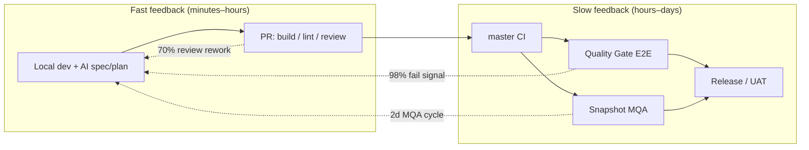

# Artifact 4 Main

**Scope:** AI-assisted engineering opportunities mapped to a generic SDLC feedback loop, applied to Cal.diy (`caldiy-masterclass`)  
**Repo evidence:** https://github.com/killroy192/caldiy-masterclass (artefacts 1–2: `AGENTS.md`, verifier subagent, Miro MCP)

---

## Contents

| # | Artefact | Purpose |
|---|----------|---------|
| 1 | [sdlc-ai-use-cases.md](./sdlc-ai-use-cases.md) | Seven AI use cases with impact, risk, effort, workflow pattern, context, and verification |
| 2 | [sdlc-value-stream-map.md](./sdlc-value-stream-map.md) | Lightweight value stream map derived from the SDLC JSON, with Cal.diy overlay and feedback hotspots |
| 3 | [sdlc-prioritized-next-steps.md](./sdlc-prioritized-next-steps.md) | Ranked adoption roadmap with gates and owners |

---

## Summary

The generic SDLC diagram describes a **multi-environment pipeline** (local → PR → master → five test environments → release → UAT) with long manual QA cycles and high negative-feedback rates on automated checks (E2E sanity ~98%, nightly regression ~95%, code review ~70%). Cal.diy already has building blocks from artefacts 1–3 (agent rules, spec/plan/context-map/verification skills, verifier subagent, Miro MCP).

**Highest-leverage AI insertion points:**

1. **Before PR** — spec/plan/context package + verifier subagent (shrinks code-review rework and scope creep).
2. **During local dev** — `ci-type-check-first` ordering and targeted test generation from verification plans (addresses integration-test gaps without waiting for nightly E2E).
3. **After CI** — AC traceability matrix in artefact5 style (separates real defects from environment noise in high-failure E2E stages).

**Deferred (higher effort / risk):** autonomous E2E flake auto-fix, full API contract CI from agent diffs.

---

## Methodology

| Input | How used |
|-------|----------|
| SDLC JSON `states` / `activities` | Identified stations, processing times, `negativeFeedbackFrequency`, and `precision` as proxy metrics for wait time and rework |
| Artefacts 1–3 | Mapped existing Cal.diy AI capabilities to SDLC pain points |
| `main.md` checklist | Each use case documents impact, risk, effort, workflow, context, and verification |

**Rating scales**

- **Impact:** reduction in lead time, rework, or escaped defects if adopted team-wide  
- **Risk:** chance of wrong merges, false confidence, or security/process harm  
- **Effort:** setup + ongoing maintenance for one squad  

---

## Lightweight value stream (overview)

See [sdlc-value-stream-map.md](./sdlc-value-stream-map.md) for full station detail and Cal.diy command mapping.

---

## Prioritized next steps (top 3)

| Priority | Action | Why |
|----------|--------|-----|
| **P0** | Require spec + verification plan before agent implementation | Cuts Snapshot/Sprint MQA rework (50–100% precision on bug-fix testing in source JSON) |
| **P0** | Run verifier subagent before opening PR | Targets PR code-review hotspot (70% negative feedback, ~1 h processing) |
| **P1** | Standardize pre-push agent command chain | `yarn type-check:ci --force` → `TZ=UTC yarn test` → Biome — reduces master build noise |

Full roadmap: [sdlc-prioritized-next-steps.md](./sdlc-prioritized-next-steps.md).

---

## Miro visual

**[Cal.diy SDLC + AI Touchpoints](./SDLC_Touchpoints.jpg)** — lightweight value stream with AI insertion points (red = high rework signal from source JSON; purple = AI workflow).
