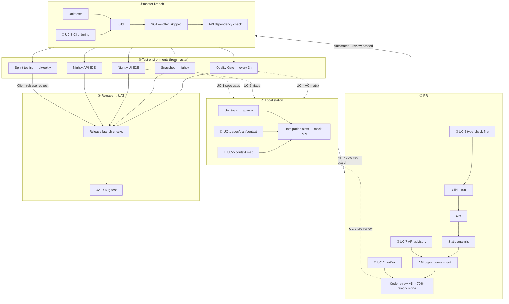
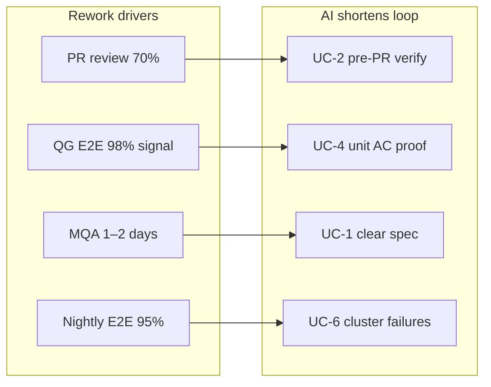

# Lightweight Value Stream Map

---

## End-to-end flow

---

## Station summary

| Station | Trigger | Dominant activities | Proc. time (source) | Neg. feedback % | Precision % | AI touchpoint |
|---------|---------|---------------------|---------------------|-----------------|-------------|---------------|
| **Local station** | On-demand | Unit tests, mock integration tests | 5 min – 5 h | ~80 (IT) | ~98 (IT) | UC-1, UC-5 |
| **PR** | Per push | Build, lint, SCA, API check, **code review** | ~10 min – **1 h** | **~70 (review)** | ~95–100 | UC-2, UC-3, UC-7 |
| **master** | Merge | Build, API check (SCA gap) | ~10–20 min | ~2 (build) | ~50 (build) | UC-3 |
| **Quality Gate** | Every 3 h | Deploy BE/FE, **E2E sanity 270 tests** | ~2 h deploy + 2 h tests | **~98 (E2E)** | ~50 | UC-4, UC-6 |
| **Snapshot** | Nightly | **MQA feature + bug-fix** | **1–2 days** | 15–40 | 50–100 | UC-1 (prevent) |
| **Nightly UI E2E** | Nightly | Full regression 4–5k cases | **~6 h** | **~95** | ~50 | UC-4, UC-6 |
| **Nightly API E2E** | Nightly | API integration, no mocks | ~4 h | ~90 | ~30 | UC-7 |
| **Sprint testing** | Biweekly Tue | E2E + MQA + migration | 1.5–2 days | 2–95 | 20–90 | UC-4 |
| **Release → UAT** | ~Yearly release | Release notes, migrations, client UAT | Weeks | — | — | UC-4 manual matrix |

*Processing times from JSON `processingTime` (seconds) converted to human units. Empty cells in source treated as “variable / not measured”.*

---

## Cal.diy equivalent mapping

| Generic SDLC station | Cal.diy practice | Typical commands / artefacts |
|----------------------|------------------|------------------------------|
| Local station | Feature branch dev | `yarn dev` / `yarn dx`, `yarn vitest run <file>`, artefact spec/plan/context |
| PR | GitHub PR + CI | `yarn type-check:ci --force`, `TZ=UTC yarn test`, Biome, human review |
| master | `main` CI | Turbo type-check, unit tests, build |
| Quality Gate | PR CI + optional staging | Vitest integration mode, Playwright subset (when configured) |
| Snapshot / MQA | Staging QA, PO acceptance | Manual AC walkthrough; artefact5 evidence |
| Nightly E2E | `yarn e2e` (Playwright) | Deferred in v1 features per instant-meeting plan |
| API E2E | API v2 integration tests | `apps/api/v2` test suites |
| Release | Deploy Cal.com / self-host | Changelog, migration notes |

---

## Feedback loops (waste hotspots)

**Interpretation**

- **98% / 95% negative feedback** on E2E does not mean 98% product bugs — source notes env provisioning, data, and flakes. UC-4 prevents debating feature quality when unit-level AC proof already exists.
- **70% code-review negative feedback** is partly style and scope — UC-2 front-loads spec compliance and test evidence.
- **2-day MQA** cycles often trace to unclear DoD — UC-1 ties DoD to spec ACs before code starts.

---

## Value stream metrics to track (recommended)

| Metric | Baseline (generic JSON) | Target with AI workflow |
|--------|-------------------------|-------------------------|
| PR review rounds per feature | ~2+ (inferred from 70% signal) | ≤ 1.5 |
| Time spec → first PR | Unmeasured | < 1 day with agent |
| AC with automated evidence at PR | Low | ≥ 80% of must-have ACs |
| E2E failures attributed to feature vs env | Unmeasured | Classify within 4 h (UC-6) |
| Agent PRs passing type-check first run | Unmeasured | ≥ 90% |

---

## Miro visual (optional)

The source JSON can be rendered on a Miro board via `diagram_create` (see artefact2 Miro MCP). Suggested board content:

1. Left-to-right stations matching this document
2. Color:red for neg. feedback > 70%
3. Sticky notes for Cal.diy command mapping per station

*No board URL committed in this artefact — create on team board when running a workshop.*
