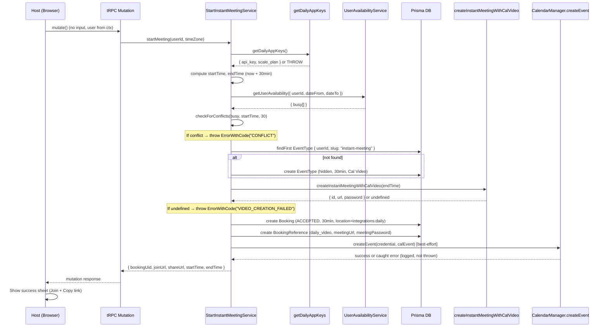
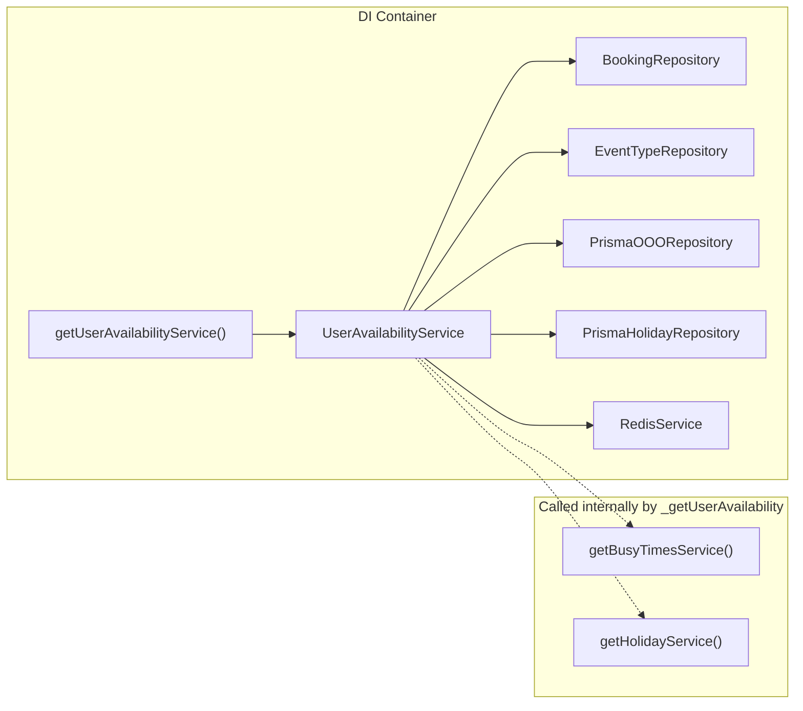
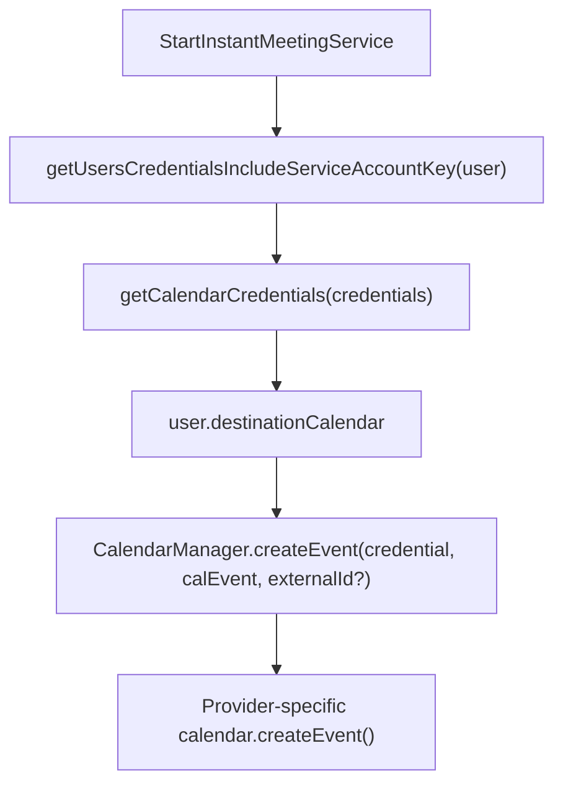

# Context Map: Start Instant Meeting

**Spec:** `artefacts/specs/feature-start-instant-meeting.spec.md`
**Plan:** `artefacts/plans/feature-start-instant-meeting.plan.md`
**Date:** 2026-06-09

---

## Files Involved

### Primary — will be created or modified

| File | Role | Action |
|------|------|--------|
| `packages/features/instant-meeting/service/StartInstantMeetingService.ts` | Core business logic | **Create** |
| `packages/trpc/server/routers/loggedInViewer/startInstantMeeting.schema.ts` | Zod input/output | **Create** |
| `packages/trpc/server/routers/loggedInViewer/startInstantMeeting.handler.ts` | tRPC handler | **Create** |
| `packages/trpc/server/routers/loggedInViewer/_router.tsx` | Mutation registration | **Modify** (add 1 route) |
| `apps/web/modules/bookings/components/StartInstantMeetingButton.tsx` | UI trigger | **Create** |
| `apps/web/modules/bookings/components/InstantMeetingSuccessSheet.tsx` | Success state UI | **Create** |
| `apps/web/modules/bookings/components/BookingListContainer.tsx` | Toolbar integration | **Modify** (add button) |
| `apps/web/modules/bookings/components/BookingCalendarContainer.tsx` | Toolbar integration | **Modify** (add button) |
| `packages/i18n/locales/en/common.json` | Translation keys | **Modify** (add ~8 keys) |

### Secondary — consumed / called into (read-only reference)

| File | What we use from it |
|------|---------------------|
| `packages/features/conferencing/lib/videoClient.ts` | `createInstantMeetingWithCalVideo(endTime)` |
| `packages/app-store/dailyvideo/lib/getDailyAppKeys.ts` | `getDailyAppKeys()` to validate config |
| `packages/features/di/containers/GetUserAvailability.ts` | `getUserAvailabilityService()` factory |
| `packages/features/availability/lib/getUserAvailability.ts` | `UserAvailabilityService.getUserAvailability()` |
| `packages/features/bookings/lib/conflictChecker/checkForConflicts.ts` | `checkForConflicts({ busy, time, eventLength })` |
| `packages/features/calendars/lib/CalendarManager.ts` | `createEvent(credential, calendarEvent, externalId?)` |
| `packages/features/availability/lib/findUsersForAvailabilityCheck.ts` | Load user with credentials for availability |
| `packages/prisma/schema.prisma` | Booking, EventType, BookingReference models |
| `packages/lib/CalEventParser.ts` | `getVideoCallUrlFromCalEvent` pattern |
| `packages/features/bookings/lib/handleNewBooking/createBooking.ts` | Booking create field patterns |

### Tertiary — patterns to follow (not called directly)

| File | Pattern it demonstrates |
|------|------------------------|
| `packages/trpc/server/routers/loggedInViewer/connectAndJoin.handler.ts` | `authedProcedure` mutation with lazy import |
| `packages/features/bookings/lib/handleConfirmation.ts` | Lightweight calendar write via `EventManager.create` |
| `apps/web/modules/onboarding/hooks/useSubmitPersonalOnboarding.ts` | Lazy event type creation via `eventTypesHeavy.create` |
| `packages/features/bookings/repositories/BookingRepository.ts` | `createBookingForManagedEventReassignment` field patterns |

---

## Data Flow

### Dependency chain for availability check

### Calendar event creation dependency chain

---

## Likely Change Points

| Change point | Confidence | Notes |
|--------------|------------|-------|
| `loggedInViewerRouter/_router.tsx` — add mutation | High | Single line addition, same pattern as `connectAndJoin` |
| `BookingListContainer.tsx` toolbar right section | High | After `
` spacer |
| `BookingCalendarContainer.tsx` toolbar right section | High | In the `
` cluster with Today/Prev/Next/ViewToggle |
| `packages/features/instant-meeting/` — new directory | High | Clean separation from existing booking services |
| `en/common.json` — add keys | High | Standard i18n additions |
| Event type creation via direct `prisma.eventType.create` | Medium | Alternative: could use `trpc.viewer.eventTypesHeavy.create` handler internally, but direct Prisma is simpler for server-side lazy-create |

---

## Files NOT to Touch

| File | Reason |
|------|--------|
| `packages/prisma/schema.prisma` | No schema changes (spec constraint) |
| `packages/features/bookings/lib/service/RegularBookingService.ts` | Too complex for this flow; explicit non-goal |
| `packages/trpc/server/routers/loggedInViewer/connectAndJoin.handler.ts` | Orphaned team flow; must remain unchanged (AC-9) |
| `apps/web/modules/connect-and-join/connect-and-join-view.tsx` | Orphaned team UI; unrelated |
| `packages/features/bookings/lib/handleNewBooking/*` | Full booking pipeline; we bypass it |
| `packages/features/ee/workflows/*` | Workflows are removed in Cal.diy |
| `InstantMeetingToken` model or references | Team instant flow; explicitly not used |
| `apps/web/modules/onboarding/*` | Onboarding creates defaults at signup; our feature uses lazy-create at first use (separate concern) |
| `packages/features/eventtypes/lib/defaultEvents.ts` | Virtual/dynamic events; unrelated pattern |
| `packages/app-store/dailyvideo/lib/VideoApiAdapter.ts` | Already abstracted behind `createInstantMeetingWithCalVideo` |
| `apps/web/app/(use-page-wrapper)/video/[uid]/page.tsx` | Video join page works as-is; no changes needed |

---

## Missing Context

| Area | What's unknown | Risk level | How to resolve |
|------|----------------|------------|----------------|
| **User credential loading for calendar** | Exact import path and function signature for `getUsersCredentialsIncludeServiceAccountKey` — used in `handleConfirmation` but not explored in detail | Low | Read `packages/features/bookings/lib/getAllCredentials.ts` at implementation time |
| **`CalendarEvent` construction** | Minimum required fields for `createEvent` to succeed (organizer, attendees, title are type-required; but what does the provider actually need?) | Low | Follow `handleConfirmation` pattern: same fields minus attendees |
| **`checkForConflicts` import path** | Exact module location and whether it handles empty `busy` arrays gracefully | Low | Import from `@calcom/features/bookings/lib/conflictChecker/checkForConflicts` |
| **Prisma `Booking.create` without attendees** | Schema allows it (attendees is optional relation), but does any downstream code break if no attendees exist on a booking? | Medium | Test: video join page loads booking attendees but uses them for display only; empty array is safe |
| **`findUsersForAvailabilityCheck` return shape** | Includes credentials and selected calendars — but does it include `destinationCalendar` needed for calendar write? | Medium | Read function at implementation; may need supplemental query for `destinationCalendar` |
| **Transaction semantics** | If video room is created (Daily API call) but booking DB write fails, the room is orphaned. Is this acceptable? | Low | Yes — Daily rooms auto-expire (endTime + 1 hour); acceptable for v1 per plan |
| **Feature flag gating** | Should "Start meeting" be behind a feature flag? Not mentioned in spec/plan | Low | Recommend: no flag for v1 (it's a new additive feature with no regression risk) |

---

## Risky Assumptions

| # | Assumption | Risk | Mitigation |
|---|-----------|------|------------|
| R1 | `createInstantMeetingWithCalVideo` returns stable `VideoCallData` type with `.url`, `.id`, `.password` | Medium — function returns `videoAdapter?.createInstantCalVideoRoom?.(endTime)` which is optional chaining | Validate return shape at runtime; type-narrow before use |
| R2 | Booking without attendees is valid for `/video/[uid]` page | Medium — video page selects `attendees` but only displays them; empty array should be fine | Verify video page SSR doesn't 500 on empty attendees |
| R3 | `getUserAvailabilityService()` can be called outside a request context (no Redis issues) | Low — factory returns a singleton service backed by module-level container | Already used in booking handlers which are per-request |
| R4 | Hidden event type with slug `instant-meeting` won't conflict with user-created types | Low — unlikely slug choice by users | Use `findFirst` before create; reuse if found |
| R5 | Calendar write is best-effort (failure doesn't roll back booking) | Medium — user may not see calendar block | Log warning; document behavior; Cal.diy booking still prevents double-booking |
| R6 | Direct `prisma.eventType.create` works without `profileId` | Medium — onboarding uses tRPC handler which sets `profileId` from user profile | Check if `profileId` is required by any downstream logic; if so, load user profile and set it |
| R7 | No email/webhook side effects needed | Low — standard booking webhooks may fire via Prisma middleware or event hooks | Acceptable; spec says "normal booking creation hooks fire if applicable" |
| R8 | `BusyTimesService` is called internally by `_getUserAvailability` via `getBusyTimesService()` (not injected) | None — confirmed via code exploration | No action needed; just awareness |

---

## Smallest Safe Implementation Boundary

### PR 1 — Backend mutation (no UI, no calendar sync)

**Scope:** Zod schema + service (availability + video + booking + reference) + handler + router registration + tests

**Boundary rules:**
- No frontend changes
- No calendar write (defer to PR 1b or PR 2)
- No email notifications
- No feature flag
- Hidden event type created with `prisma.eventType.create` directly (no tRPC self-call)
- Calendar sync marked as `// TODO: implement in follow-up` with a comment

**Why this is safe:**
- Mutation is unreachable without UI (no existing code calls it)
- No modifications to existing behavior
- Fully testable via unit tests against mocked dependencies
- ~150-200 lines of service + ~50 lines schema + ~40 lines handler + ~20 lines router = ~260-310 lines total (under PR limit)

### PR 1b — Calendar sync addition (optional, can merge into PR 1 if small)

**Scope:** Load user credentials + destination calendar, call `CalendarManager.createEvent` in the service, wrap in try/catch

**Why separated:** Calendar credential loading adds ~40-60 lines and introduces a new dependency (`getAllCredentials` or `getUsersCredentialsIncludeServiceAccountKey`). If this pushes PR 1 over comfort size, split it.

### PR 2 — Frontend

**Scope:** Button component + success sheet + toolbar integration + i18n keys

**Boundary rules:**
- Only adds new components + imports to existing toolbar containers
- No modification to Shell, ShellMainAppDir, or navigation
- No modification to bookings data fetching or state

---

## Cross-reference: Onboarding vs Instant Meeting

The onboarding flow is **not touched** by this feature, but shares one pattern:

| Concern | Onboarding | Instant Meeting |
|---------|-----------|-----------------|
| Event type creation | Client-side via tRPC `eventTypesHeavy.create` on completion | Server-side via direct `prisma.eventType.create` on first mutation |
| When | Once (on onboarding completion, if 0 types exist) | Lazy (on first instant meeting attempt, if `instant-meeting` slug absent) |
| Fields | title, slug, length, hidden | title, slug, length, hidden=true, userId, users.connect |
| `profileId` | Set by tRPC handler automatically | **Must be set manually** (or omitted if not enforced) |
| Guarding | `eventTypes?.length === 0` | `findFirst { userId, slug }` |

**Key insight:** Onboarding uses tRPC handler which auto-fills `profileId`, default locations, and `calVideoSettings`. Direct Prisma create skips these. For a hidden internal event type that's never shown in UI or booked publicly, this is acceptable — but `profileId` should be verified as non-breaking.

---

## Validation Checklist (pre-implementation)

- [ ] Confirm `createInstantMeetingWithCalVideo` return type matches `VideoCallData` expectations
- [ ] Confirm `/video/[uid]` page handles booking with 0 attendees gracefully
- [ ] Confirm `prisma.eventType.create` without `profileId` doesn't break downstream
- [ ] Confirm `getUserAvailabilityService()` import path from feature package
- [ ] Confirm `checkForConflicts` handles empty `busy[]` (returns no conflict)
- [ ] Confirm `WEBAPP_URL` is importable in service layer
