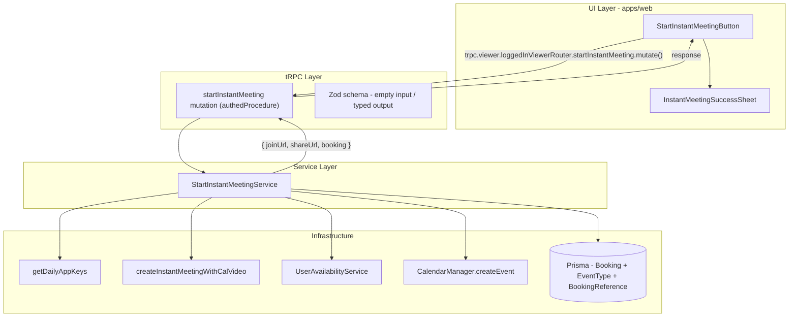

# Start Instant Meeting — Implementation Plan

## Confirmed Facts

- `createInstantMeetingWithCalVideo(endTime)` in [`packages/features/conferencing/lib/videoClient.ts`](packages/features/conferencing/lib/videoClient.ts) exists, is exported, and is **not called anywhere** — it creates a Daily room using the global `DAILY_API_KEY` (no per-user credential needed).
- `getDailyAppKeys()` reads the global `daily-video` app row; throws (Zod parse failure) if keys are missing — the video function catches this and returns `undefined`.
- `UserAvailabilityService._getUserAvailability({ userId, dateFrom, dateTo })` returns `busy[]` + `dateRanges[]`; calling with a 30-min window will reveal conflicts from both Cal.diy bookings and connected calendars.
- The video join page (`/video/[uid]`) requires a `BookingReference` with `type: "daily_video"`, `meetingUrl` (raw Daily URL), and `meetingPassword` (Daily token). It loads the booking by `uid`.
- `metadata.videoCallUrl` stores the **public** join URL: `${WEBAPP_URL}/video/${booking.uid}` — this is what the host copies/shares.
- `EventManager.create(evt)` handles both video creation (via user credential) and calendar write — but for Cal Video, the global key path (`createInstantMeetingWithCalVideo`) is more appropriate since no per-user credential is required.
- Hidden event types (`hidden: true`) are not listed on public profiles but are still bookable by direct URL. Unique constraint: `[userId, slug]`.
- Minimum EventType fields: `title`, `slug`, `length`, `userId`.
- tRPC mutations in `loggedInViewerRouter` follow: `authedProcedure.input(ZSchema).mutation(async (opts) => { const handler = await import(...); return handler(opts); })`.
- Bookings toolbar in `BookingListContainer` has a right-aligned section (after `grow` spacer) where action buttons live — works for both v2 and v3 users.
- `BookingCalendarContainer` has a separate right-aligned toolbar section.
- `RegularBookingService` is explicitly **non-instant** — its handler is too complex (payments, guests, seated events, etc.) for this use case.

## Assumptions

- **A1**: The hidden event type slug `instant-meeting` is reserved per user and will not conflict with user-created event types (users are unlikely to create this slug; if collision occurs, the lazy-create will find the existing type instead of failing).
- **A2**: No attendees at creation time — the host shares the link post-creation. The booking is valid without attendees in the schema.
- **A3**: Calendar event creation uses `CalendarManager.createEvent` with the host's destination calendar credential. If no calendar is connected, the booking still succeeds (no calendar block, but the Cal.diy booking itself blocks the slot).
- **A4**: No confirmation emails sent for instant meetings in v1 (no attendees to notify; host is initiating and sees the result immediately).
- **A5**: Start time is truncated to the current second (no rounding to next minute) — existing booking creation uses exact `dayjs.utc()` timestamps.
- **A6**: Rate limiting is not implemented in v1 — the availability check naturally prevents spam (cannot create overlapping meetings).
- **A7**: The share URL is `${WEBAPP_URL}/video/${booking.uid}` (the same Cal Video join page guests use for any Daily booking).

## Open Questions Resolved

| # | Decision | Rationale |
|---|----------|-----------|
| OQ-1 | Share URL = `/video/{uid}` only | Consistent with all Cal Video bookings; guests join the same way |
| OQ-2 | Start time = `now` (seconds truncated to 0) | Matches `dayjs().startOf("minute")`; avoids sub-minute oddness |
| OQ-3 | UI placement: bookings toolbar (right side) | Works for both v2 and v3 users without modifying `ShellMainAppDir` |
| OQ-4 | Hidden event type: lazy-create on first mutation call | Avoids schema migration; checked/created atomically in the handler |
| OQ-5 | No booking confirmation emails in v1 | No attendees; host sees result in-app; revisit when guest invite is added |

## Files / Modules Involved

### New files

| File | Purpose |
|------|---------|
| `packages/trpc/server/routers/loggedInViewer/startInstantMeeting.schema.ts` | Zod input/output schemas |
| `packages/trpc/server/routers/loggedInViewer/startInstantMeeting.handler.ts` | Mutation handler (orchestration) |
| `packages/features/instant-meeting/service/StartInstantMeetingService.ts` | Business logic service |
| `apps/web/modules/bookings/components/StartInstantMeetingButton.tsx` | UI trigger button |
| `apps/web/modules/bookings/components/InstantMeetingSuccessSheet.tsx` | Success sheet (join + copy link) |

### Modified files

| File | Change |
|------|--------|
| `packages/trpc/server/routers/loggedInViewer/_router.tsx` | Register `startInstantMeeting` mutation |
| `apps/web/modules/bookings/components/BookingListContainer.tsx` | Add StartInstantMeetingButton to toolbar |
| `apps/web/modules/bookings/components/BookingCalendarContainer.tsx` | Add StartInstantMeetingButton to toolbar |
| `packages/i18n/locales/en/common.json` | Add i18n keys |

### Referenced (read-only, patterns to follow)

| File | Why |
|------|-----|
| `packages/features/conferencing/lib/videoClient.ts` | Call `createInstantMeetingWithCalVideo` |
| `packages/features/availability/lib/getUserAvailability.ts` | Call availability check |
| `packages/features/calendars/lib/CalendarManager.ts` | Call `createEvent` for calendar sync |
| `packages/app-store/dailyvideo/lib/getDailyAppKeys.ts` | Validate Daily config exists |
| `packages/features/bookings/repositories/BookingRepository.ts` | Booking create pattern |

## Architecture



## Atomic Implementation Steps

### Step 1: i18n keys

Add English translation keys to `packages/i18n/locales/en/common.json`:
- `start_instant_meeting` = "Start meeting"
- `instant_meeting_title` = "Instant Meeting"
- `instant_meeting_success` = "Meeting started"
- `instant_meeting_join_now` = "Join now"
- `instant_meeting_copy_link` = "Copy meeting link"
- `instant_meeting_link_copied` = "Meeting link copied"
- `instant_meeting_conflict` = "You have a conflicting event in the next 30 minutes"
- `instant_meeting_video_unavailable` = "Video conferencing is not configured on this instance"

### Step 2: tRPC schema

Create `startInstantMeeting.schema.ts`:
- Input: empty object (no params needed; user from context, time = now)
- Output: `{ bookingUid: string, joinUrl: string, shareUrl: string, startTime: string, endTime: string }`

### Step 3: Service — `StartInstantMeetingService`

Create the service at `packages/features/instant-meeting/service/StartInstantMeetingService.ts` with a single method `startMeeting(userId: number, userTimeZone: string)`:

1. **Check Daily keys**: Call `getDailyAppKeys()` — if throws, throw `ErrorWithCode("VIDEO_UNAVAILABLE")`
2. **Compute time window**: `startTime = dayjs.utc().startOf("minute")`, `endTime = startTime.add(30, "minute")`
3. **Check availability**: Instantiate `UserAvailabilityService`, call with `{ userId, dateFrom: startTime, dateTo: endTime }` — if `busy[]` contains any overlap with the window, throw `ErrorWithCode("CONFLICT")`
4. **Get or create hidden event type**: Query `prisma.eventType.findFirst({ where: { userId, slug: "instant-meeting" } })` — if not found, `prisma.eventType.create({ data: { title: "Instant Meeting", slug: "instant-meeting", length: 30, hidden: true, userId, users: { connect: { id: userId } } } })`
5. **Create Daily room**: Call `createInstantMeetingWithCalVideo(endTime.toISOString())` — if returns `undefined`, throw `ErrorWithCode("VIDEO_CREATION_FAILED")`
6. **Create booking**: `prisma.booking.create({ data: { uid: short-uuid, title: "Instant Meeting", startTime, endTime, status: "ACCEPTED", location: "integrations:daily", userId, eventTypeId, metadata: { videoCallUrl: \`${WEBAPP_URL}/video/${uid}\` } } })`
7. **Create BookingReference**: `prisma.bookingReference.create({ data: { type: "daily_video", uid: videoData.id, meetingUrl: videoData.url, meetingPassword: videoData.password, bookingId } })`
8. **Calendar sync** (best-effort): Load user's calendar credentials and destination calendar; if available, call `CalendarManager.createEvent(credential, calendarEvent)` — catch errors and log (non-blocking)
9. **Return**: `{ bookingUid, joinUrl: videoData.url, shareUrl: \`${WEBAPP_URL}/video/${bookingUid}\`, startTime, endTime }`

### Step 4: tRPC handler

Create `startInstantMeeting.handler.ts`:
- Extract `userId` and `user.timeZone` from `ctx`
- Instantiate `StartInstantMeetingService` with dependencies
- Call `service.startMeeting(userId, timeZone)`
- Map `ErrorWithCode` codes to `TRPCError` (CONFLICT -> CONFLICT, VIDEO_UNAVAILABLE -> PRECONDITION_FAILED)
- Return the typed output

### Step 5: Register mutation

In `loggedInViewerRouter/_router.tsx`, add:
```typescript
startInstantMeeting: authedProcedure
  .input(ZStartInstantMeetingInputSchema)
  .output(ZStartInstantMeetingOutputSchema)
  .mutation(async ({ ctx }) => {
    const { startInstantMeetingHandler } = await import("./startInstantMeeting.handler");
    return startInstantMeetingHandler({ ctx });
  }),
```

### Step 6: UI — StartInstantMeetingButton

Create button component:
- Renders a primary `Button` with `StartIcon="video"` and text `t("start_instant_meeting")`
- On click, calls the tRPC mutation
- Shows loading state during mutation
- On success, opens `InstantMeetingSuccessSheet`
- On error, shows toast with appropriate message (conflict / video unavailable)

### Step 7: UI — InstantMeetingSuccessSheet

Create a `Sheet` (bottom sheet / modal) component:
- Displays meeting time range
- "Join now" button → opens `joinUrl` in new tab
- "Copy link" button → copies `shareUrl` to clipboard, shows success toast
- Close/dismiss action

### Step 8: Integrate button into bookings toolbar

In `BookingListContainer.tsx`, add `<StartInstantMeetingButton />` after the `grow` spacer (alongside `DataTableSegment.Select` and `ViewToggleButton`).

In `BookingCalendarContainer.tsx`, add the same button in the right-side toolbar cluster.

### Step 9: Tests

Create unit tests for `StartInstantMeetingService`:
- Happy path: user free, Daily configured → booking created with correct fields
- Conflict: user has overlapping booking → throws CONFLICT, no booking created
- Calendar busy: overlapping external event → throws CONFLICT
- No Daily keys → throws VIDEO_UNAVAILABLE
- Lazy event type creation: first call creates it, second call reuses it

## Risks

| Risk | Mitigation |
|------|------------|
| `createInstantMeetingWithCalVideo` silently returns `undefined` on failure (no error detail) | Wrap with explicit error; check return before proceeding |
| Slug collision if user already has an `instant-meeting` event type | Use `findFirst` before create; if found, reuse it regardless of its settings |
| Calendar sync failure leaves booking without external calendar block | Treat as best-effort; log warning; booking still blocks in Cal.diy |
| Race condition: two rapid clicks could create overlapping meetings | The availability check runs transactionally; second call would see the first booking and reject |
| Video room created but booking DB write fails → orphaned Daily room | Accept for v1; Daily rooms auto-expire (endTime + 1 hour); could add cleanup in future |

## Explicit Non-Goals

- No schema migration (no new DB models or columns)
- No modification to `InstantMeetingToken`, `connectAndJoin`, or any team/org instant meeting code
- No public booker page for instant meetings
- No configurable duration or provider
- No email notifications for instant meetings in v1
- No mobile-specific FAB (button in toolbar is responsive)
- No rate limiting beyond natural availability check
- No webhook trigger customization
- No docs update (separate follow-up)

## Verification Mapped to Acceptance Criteria

| AC | Verification |
|----|-------------|
| AC-1 | Test: happy path mutation returns `joinUrl` + `shareUrl`; Manual: click button when free |
| AC-2 | Test: assert booking has `status: ACCEPTED`, 30-min duration, `location: "integrations:daily"`, correct `userId` |
| AC-3 | Manual: check Google Calendar after starting meeting; Integration test with calendar mock |
| AC-4 | Test: create booking in window first, then call mutation → CONFLICT error, booking count unchanged |
| AC-5 | Test: mock `getBusyCalendarTimes` to return overlap → CONFLICT error |
| AC-6 | Test: mock `getDailyAppKeys` to throw → VIDEO_UNAVAILABLE error, no booking |
| AC-7 | Manual: open `shareUrl` in incognito → Daily room loads |
| AC-8 | Test: call mutation without auth → UNAUTHORIZED |
| AC-9 | Code review: grep for `InstantMeetingToken` and `connectAndJoin` in new files → zero references |

## Smallest Safe First Step

**Step 2 + Step 3 (service) + Step 4 (handler) + Step 5 (register)** as a single backend PR:
- Creates the tRPC mutation end-to-end (schema, service, handler, router registration)
- Testable via tRPC client or API call without UI
- No UI changes, no risk to existing pages
- Includes unit tests for the service
- ~200-300 lines of new code (well within PR size guidelines)

The UI (Steps 6-8) becomes a second small PR that wires the button and sheet to the mutation.

## PR Split Strategy

| PR | Contents | Estimated size |
|----|----------|----------------|
| PR 1 (backend) | i18n keys + schema + service + handler + router registration + tests | ~250-350 lines |
| PR 2 (frontend) | Button + Sheet + toolbar integration | ~150-250 lines |
